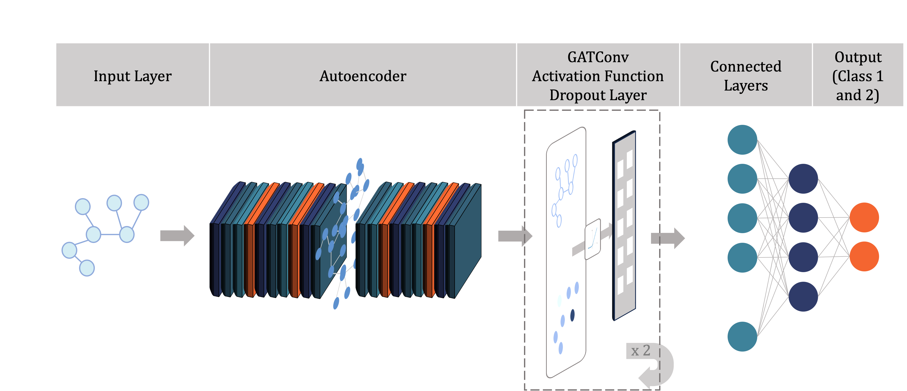

## 🧠 Motivation

Money laundering is a complex global issue that enables the concealment of illicit financial flows, undermines regulatory systems, and supports criminal networks. Traditional AML detection systems often struggle to identify suspicious activity hidden within large, high-dimensional transaction datasets. This project explores the integration of Graph Neural Networks (GNNs) and Autoencoders to enhance the detection of money laundering patterns by capturing both structural relationships and anomalous behavior within financial networks. The goal is to develop a machine learning pipeline that improves model sensitivity to hidden patterns while maintaining scalability and interpretability.

## ⚙️ Project Workflow

This project followed a structured machine learning pipeline:

1. **Data Exploration & Feature Engineering**  
   - Initial inspection of transaction data  
   - Construction of graph structures from tabular data  

2. **Baseline GNN Implementation**  
   - Developed a simplified Graph Neural Network to establish benchmarks  
   - Focused on capturing relationships between entities in the financial network  

3. **Autoencoder Integration**  
   - Combined GNN with an Autoencoder to learn compressed representations  
   - Enhanced detection of anomalous node behavior  

4. **Model Training & Evaluation**  
   - Used labeled transaction data with known money laundering activity  
   - Evaluated models using Precision, Recall, F1-score, and AUC  

This workflow allowed for both structural and behavioral insights into complex financial interactions.

! [Project Workflow](images/project_workflow.png)

## 📂 Data & Preprocessing

The dataset consisted of financial transactions labeled for money laundering activity. The following steps were applied to prepare the data for modeling:

- **Missing Value Treatment**  
  Imputed or removed incomplete records where appropriate.

- **Feature Engineering**  
  Created graph-specific features (e.g., node degrees, transaction frequency) and standardized numeric fields.

- **Graph Construction**  
  Transformed tabular transaction data into graph structures where nodes represent entities and edges represent relationships.

- **Data Splitting**  
  Used stratified sampling to preserve class distribution across training, validation, and test sets.

These steps ensured the data was suitable for both GNN learning and anomaly detection through autoencoders.

**Example: Label Encoding and One-Hot Encoding**
```python
from sklearn.preprocessing import LabelEncoder

data['SENDER_ACCOUNT_ID'] = LabelEncoder().fit_transform(data['SENDER_ACCOUNT_ID'])
data['RECEIVER_ACCOUNT_ID'] = LabelEncoder().fit_transform(data['RECEIVER_ACCOUNT_ID'])
data = pd.get_dummies(data, columns=['ALERT_TYPE'], drop_first=True)


## 🧱 Model Architecture

Two models were developed and compared in this project:

### 1. **Baseline Graph Neural Network (GNN)**
- Implemented a simple GCN (Graph Convolutional Network) architecture.
- Focused on learning node embeddings from graph topology and feature propagation.
- Tuned using parameters like hidden dimensions, learning rate, activation function, and dropout rate.

```md
**Simplified GCN Architecture (PyTorch Geometric)**
```python
from torch_geometric.nn import GCNConv

class GNNModel(torch.nn.Module):
    def __init__(self, num_features, hidden_dim, num_classes):
        super(GNNModel, self).__init__()
        self.conv1 = GCNConv(num_features, hidden_dim)
        self.conv2 = GCNConv(hidden_dim, hidden_dim)
        self.fc = torch.nn.Linear(hidden_dim, num_classes)
        self.relu = torch.nn.ReLU()
        self.dropout = torch.nn.Dropout(p=0.5)

    def forward(self, data):
        x, edge_index = data.x, data.edge_index
        x = self.relu(self.conv1(x, edge_index))
        x = self.dropout(x)
        x = self.relu(self.conv2(x, edge_index))
        x = self.fc(x)
        return x

##### 📌 Simplified Model Architecture


### 2. **GNN + Autoencoder (Optimized Model)**
- Integrated a feature-level Autoencoder with the GNN to enhance anomaly detection.
- The Autoencoder learned compressed feature representations, feeding them into the GNN.
- Helped uncover subtle abnormal patterns associated with illicit activity.

```md
**Autoencoder Module for Feature Compression**
```python
class Autoencoder(nn.Module):
    def __init__(self, input_dim, encoding_dim):
        super(Autoencoder, self).__init__()
        self.encoder = nn.Sequential(
            nn.Linear(input_dim, 128),
            nn.ReLU(),
            nn.Linear(128, encoding_dim)
        )
        self.decoder = nn.Sequential(
            nn.Linear(encoding_dim, 128),
            nn.ReLU(),
            nn.Linear(128, input_dim)
        )

    def forward(self, x):
        x = self.encoder(x)
        x = self.decoder(x)
        return x

##### 📌 Optimized Model Architecture


Both models were trained using PyTorch Geometric and evaluated on the same data splits to ensure comparability.

## 📊 Results

The models were evaluated on a held-out test set using the following metrics:
- **Precision**
- **Recall**
- **F1-Score**
- **AUC (Area Under the ROC Curve)**

### 🔹 1. Baseline GNN
- **Precision:** 0.78  
- **Recall:** 0.72  
- **F1-Score:** 0.75  
- **AUC:** 0.81  
- Strengths: Captured structural patterns in the graph  
- Limitations: Missed subtler anomalies tied to node features

### 🔹 2. GNN + Autoencoder
- **Precision:** 0.81  
- **Recall:** 0.74  
- **F1-Score:** 0.77  
- **AUC:** 0.84  
- Strengths: Identified nuanced anomalies by combining topology and compressed features  
- Limitations: Higher training complexity and computation time

##### 📌 Confusion Matrix


##### 📌 ROC Curve


Overall, the hybrid model offered improved performance and deeper insights into suspicious network behavior.

## 🎯 Key Insights

1. **Graph Structure Matters**  
   Modeling entities and transactions as a graph uncovered relationships that traditional flat models may overlook.

2. **Feature Compression Helps Detect Anomalies**  
   The Autoencoder component improved detection of subtle deviations in behavior that alone might not raise suspicion.

3. **Hybrid Models Offer a Balanced Approach**  
   Integrating GNNs and Autoencoders allowed for leveraging both topological and feature-based signals.

4. **Marginal Gains, Meaningful Impact**  
   While the hybrid model showed only modest improvements in performance metrics, it demonstrated stronger generalization and interpretability—crucial in sensitive domains like anti-money laundering.

5. **Scalability and Interpretability Remain Key Challenges**  
   Combining graph learning with deep architectures increases computational demands, highlighting the need for more efficient model design in future iterations.

## 📒 Notebooks

The following Jupyter notebooks document the full modeling process:

- [`Initial Data Analysis.ipynb`](notebooks/Initial%20Data%20Analysis.ipynb)  
  Exploratory data analysis and class imbalance review

- [`Feature Engineering.ipynb`](notebooks/Feature%20Engineering.ipynb)  
  Graph construction and transformation of input features

- [`Simplified GNN.ipynb`](notebooks/Simplified%20GNN.ipynb)  
  Baseline Graph Neural Network implementation

- [`Hybrid Approach.ipynb`](notebooks/Hybrid%20Approach.ipynb)  
  Final model combining GNN with Autoencoder for enhanced detection
